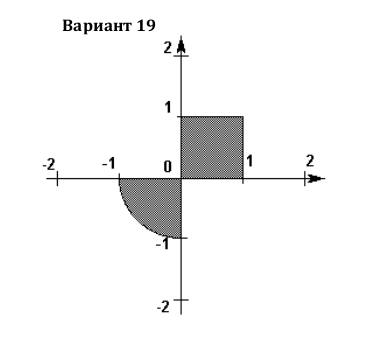

# Основы программирования. Лабораторная работа №2
[](https://travis-ci.org/z8432k/feodorov-base-coding-lab2-19)

## Определение попадания точки в область

### Вариант 19



Программа принимает 2 аргумента командной строки.

Абсциссу и ординату точки соответственно.

Сборка и запуск:

```text
$ make
$ ./bin/point_area -0.5 -0.7
Point coords: (0.50, 0.70)

Point is in the area.
```
